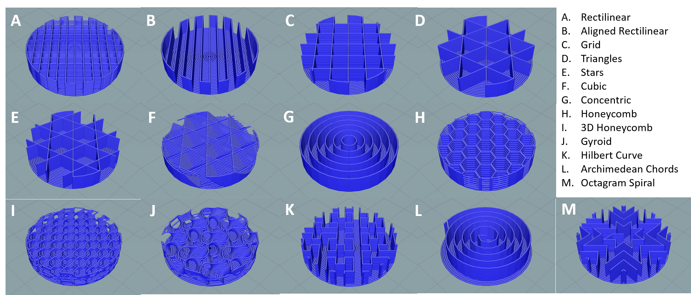
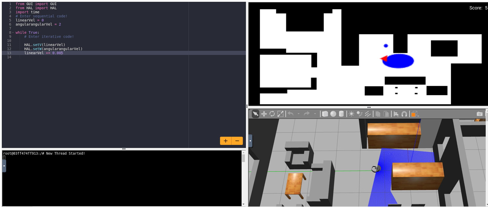
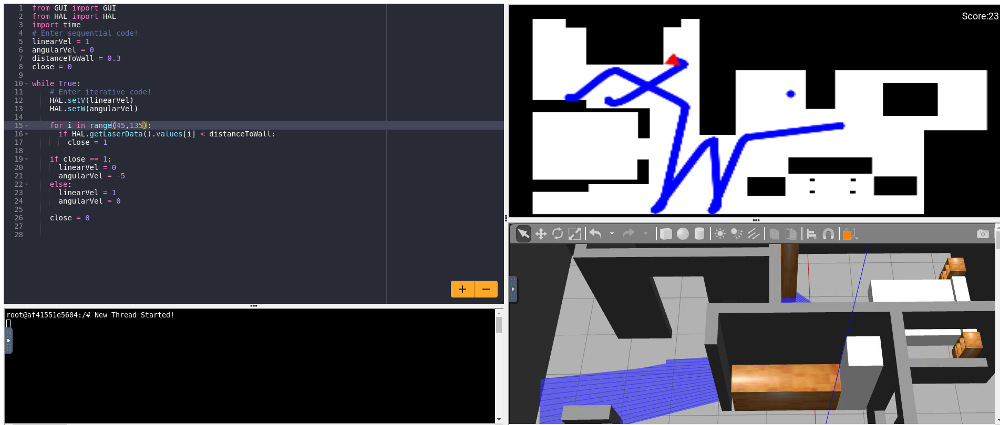

## Setup and first problems
Because this is our first exercise with this new software (Unibotics) we will have to spend some time downloading everything to get up to speed.
Follow this steps to start programming as quikly as possible:
1. Download Docker and test it with the "Hello-World" package, [the official docs have a great guide](https://docs.docker.com/desktop/)
2. Pull the current distribution of Robotics Academy Docker Image:
  ```javascript
   docker pull jderobot/robotics-academy:latest
   ```
3. Launch the docker container with one of two options, the standard one is
   ```javascript
   docker run --rm -it -p 7681:7681 -p 2303:2303 -p 1905:1905 -p 8765:8765 -p 6080:6080 -p 1108:1108 -p 7163:7163 -p 7164:7164 jderobot/robotics-academy:latest
   ```
   and for users with GPUs and software compatible with [virtualGL](https://virtualgl.org/)
   ```javascript
   run --rm -it --device /dev/dri -p 7681:7681 -p 2303:2303 -p 1905:1905 -p 8765:8765 -p 6080:6080 -p 1108:1108 -p 7163:7163 -p 7164:7164 jderobot/robotics-academy:latest
   ```
4. Now all that is left is to create a Unibotics account, navigate to the "Academy" tab, and start programing.

In my case, I had some compatibility problems caused by Firefox, that made the VNC viewers not load properly, thankfully, my question was answered in a pinned comment on the unibotics forum.
They have proven to be a very handy resource, so try to check them periodically.

## Objective of this task
To make an autonomous robot that can move over as much floor area as possible, without colliding with the walls and other objects. To achieve this, the robot is going to have to combine two behaviours, an obstacle avoidance movement sistem, and a basic coverage algorithms.

For the obstacle avoidance software we will use the lidar, that when detecting a wall, will randomly choose another direction to move in.
And for the coverage algorithm, we will ignore the many complicated solutions there are, and settle with a simple spiral pattern.


## First tests with the site
To learn how to use the robot and to test diferent parameters I devised two small tests for some standalone features.
The firs test was making the robot do the space filling spiral, playing around with linear and angular speeds, gave me a feel of the values and how they affect the robot.


The next test was one with the laser, I made a simple code that made it so the robot would detect a wall, and turn away from it before continuing forward. Thanks to this, I was able to select a range of angles to measure, and at which distance to stop the robot, so that it doesn't damage itself, but it can get close enough to a wall to be able to get through doorways.


## Creating a state machine
Now that we are familiar with the robot and how it behaves, lets make a simple state machine. You can probalby use less, or even more states, but I will use four states in a circular pattern.
[ADD SCHETCH]

1. **Spiral**: Executes the space covering algorithm, and switches states when a wall is detected.
2. **Turn**: Turns at a fixed speed for a random amount of time, uses a loop that checks time, NOT A SLEEP in order to keep it reactive
3. **Forward**: Goes straight ahead at a fixed speed until it finds another wall, stores the amount of time in this state
4. **Backwards**: Goes backwards at a fixed speed for about half of the time the forward state was active, this is to get to the middle point of two walls before moving on to the spiral.

## Testing the state machine
[Video1.webm](https://github.com/lmorenog2021/lmorenog2021.github.io/assets/92941117/2e4e2cd0-4028-4dd6-9ad2-57e33b60903a)

[Video2.webm](https://github.com/lmorenog2021/lmorenog2021.github.io/assets/92941117/b963f338-a54a-49d1-bcee-1d78e6584ff9)


## Success! 
And that's it! We now have a robot vacuum controlled by a simple state machine, and while it's performance will vary depending on luck, it works well enough for a first proyect.

