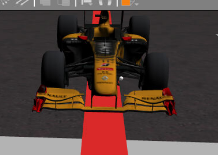

## Objective of this task
For this excercise we are tasked with making the virtual F1 car run around the circuit following the red line.

Because this is a challenging task to take all at once, we will fragment it into two parts that can be tested and debugged independently. The first part is making the artificial vision work,
and after that we can takcle the PID controller for the movement.

## Configuring artificial vision
We are using OpenCV in python, so reading [this)](https://docs.opencv.org/4.x/index.html) tutorial will be recomended.
Our objective is to find the center of the line. There are many ways to do this, but they all start with masking out all of the colors but the red we need, for this we will use this code:

```python
while True:
    # Enter iterative code!
    # define the list of boundaries
    image = HAL.getImage()
    w = image.shape[1]
    for (lower, upper) in boundaries:
    	# create NumPy arrays from the boundaries
    	lower = np.array(lower, dtype = "uint8")
    	upper = np.array(upper, dtype = "uint8")
    	# find the colors within the specified boundaries and apply
    	# the mask
    	mask = cv2.inRange(image, lower, upper)
    	output = cv2.bitwise_and(image, image, mask = mask)
```
Now we can process the image to find the center of the line. There are two ways to do this
1. Manually iterate through each pixel in a line or segment of the road.  
   ✅ Easy to implement  
   ✅ Can be less demanding than scanning the complete image  
   ❌ Less precise   
   ❌ Less reactive  
3. Use OpenCV functions to find the centroid of the line  
   ✅ More reliable  
   ✅ Better aproximation helps when taking curves  
   ❌ Harder to implement  
   ❌ Processor heavy  

We chose to use the second option to save us some trouble when making the PID, as the more advanced artificial vision will solve some problems that could arise when taking corners.
To make this we used this code
```python
    	#Take the mask and make it grey, then use the grey image to make a threshold image
    	grayImage = cv2.cvtColor(output, cv2.COLOR_BGR2GRAY)
    	ret, thresh = cv2.threshold(grayImage, 50, 255, cv2.THRESH_BINARY)
    	#Take the thresh and take out the contours needed to draw the outlines
    	contours, hierarchy = cv2.findContours(thresh, cv2.RETR_EXTERNAL, cv2.CHAIN_APPROX_NONE)
    	cv2.drawContours(output, contours, 0, (0,255,0), 2)
    	#Using the contours and moments, find the center of the shape we made, and filter any cero values
    	M = cv2.moments(contours[0])
    	if M['m00'] == 0:
    	  center_x = 0
    	else:
    	  center_x = round(M['m10']/M['m00'])
    	  center_y = round(M['m01']/M['m00'])
    	cv2.circle(output, (center_x, center_y),5,(0,255,0),-1)
    	
    	#Display the camera image and the center image side by side
    	GUI.showImage(np.hstack([image, output])
```

## Making a PID controller
For this we are going to reuse the code from a previous project, one of the many benefits of object oriented programming.  
```python
def clamp(n, min, max):
    if n < min:
        return min
    elif n > max:
        return max
    else:
        return n

class PID:
  def __init__(self, min_ref, max_ref, min_output, max_output):
      self.min_ref_ = min_ref
      self.max_ref_ = max_ref
      self.min_output_ = min_output
      self.max_output_ = max_output
      self.prev_error_ = self.int_error_ = 0.0
    
      self.KP_ = 0.41
      self.KI_ = 0.06
      self.KD_ = 0.53
  
  def setPid(self, n_KP, n_KI, n_KD):
      self.KP_ = n_KP
      self.KI_ = n_KI
      self.KD_ = n_KD
  
  def getOutput(self, new_reference):
    ref = new_reference
    output = 0.0
  
    # Proportional Error
    direction = 0.0
    if ref != 0.0:
      direction = ref / abs(ref)
  
    if abs(ref) < self.min_ref_ :
      output = 0.0
    elif abs(ref) > self.max_ref_:
      output = direction * self.max_output_
    else:
      output = direction * self.min_output_ + ref * (self.max_output_ - self.min_output_)
  
    # Integral Error
    self.int_error_ = (self.int_error_ + output) * 2.0 / 3.0
  
    # Derivative Error
    deriv_error = output - self.prev_error_
    self.prev_error_ = output
  
    output = self.KP_ * output + self.KI_ * self.int_error_ + self.KD_ * deriv_error
  
    return clamp(output / self.max_ref_, -self.max_output_, self.max_output_)

pidW = PID(-320,320,-4,4)
pidW.setPid(0.46,0.05,1.3)
```
The way this PID implementation works is by setting up the limits of the inputs it can recieve, and the limits of the outputs it can write. Then you can tweak the constants Kp, Ki, Kd depending on how you want the PID to behave. We have set the input limits to (-320, 320) to represent the width of the screen, and the oitput limits as (-1, 1) as having any more anglar velocity will make the car spin out of control.

[OutControlCar.webm](https://github.com/lmorenog2021/lmorenog2021.github.io/assets/92941117/124e94d5-3bed-44cc-87ce-b2445ac62881) 

(We take 320 as the center of the image, even though the camera is off to the side of the car. 384 would have been the correct point to take if we wanted a perfectly centered vehicle, but for simplicity we decided against it)
<p align="center">
  
  
</p> 
For the constants you either have to try and make a mathematical model of the car, or simply test different values and find the best ones, I reccomend folllowing [this](https://pidexplained.com/how-to-tune-a-pid-controller/) tutorial and make some educated guesses. After much experimentation, this are the ones we optimised for a linear velocity of 4'5.

## Testing for speed
Using a constant velocity can give us great results, but to truly achieve speed we need to, like any racer, accelerate in the straights, and slow down before the curves. I had tried two methods:
1. **Using the PID for linear velocity**
   My first idea was to simply take a high linear velocity, and reduce it by the error from the turning PID, this way when the car was going straight and the error was low, it would move faster, and when the car was turning and had a high error, it would slow down. While the idea was great on paper, in practice it proved to be a whole different thing, as simultaneously changing both the angular and linear speed made the car unstable and very wobbly, in a way that no PID changing could solve.
   ```python
    error = pidW.getOutput(320 - center_x)	
    HAL.setW(error)
    HAL.setV(5-abs(error))
   ```
2. **Using a NEW PID for linear velocity**
   Moving on to another idea, using the *y* axis of the centroid as the input for a *NEW* PID. The logic behind this change was that when the image was of a straight, the *y* axis was constant at a predictable level; but when fed a curve, the added pixels on top of the image shifted the axis up a considerable amount of levels. This phenomenom is what we will use to create a new PID to regulate the linear velocity.
   ```python
   pidW = PID(-320,320,-1,1)
   pidW.setPid(0.46,0.05,1.3)

   pidV = PID(0, 798, 0, 5)
   pidV.setPid(0.46, 0.05, 1.3)  
   while True;
       # Enter iterative code!
       #...
       speedW = pidW.getOutput(320 - center_x)
       speedV = pidW.getOutput(398 - center_y)
       print("Normal  Speed: ", 5-abs(speedW))
       HAL.setW(speedW)
       HAL.setV(5 - abs(speedW))

   ```
   The problem of this concept came when leveling two different PID proved to be too finicky to be done by hand. While a more knowlegeable engineer could probably make a mathematical model to iron out all the kinks, in our case it's out of the scope of the project.
3. **Using different set speeds**
   The problem with the las attempt was adding complexity with the PIDs, but the *y* axis concept had potential, so we fell back on ol'reliable, the if statement.
   By taking three different set speeds and asociating them with three possible levels on the *y* plane, we could benefit from more controlled changes that can be adapted to work with our PID.
   ```python
   if (center_y > 418 or center_y <378){
    	    print("Curve")
    	    HAL.setV(4)
    	  }elif (center_y > 408 or center_y <388){
    	    print("Light curve")
    	    HAL.setV(4.5)
    	  }else{
    	    print("Straight")
    	    HAL.setV(5)
    	  }
   ```
   And it works!
   ...sometimes. It can finish laps, but once in a while, it will deviate from the path and lose itself, so it becomes a tradeoff, an improvement in speed vs the flawless laps of the constant velocity model.

## Results
In the end, to get some good fotage, we reduced the inicrements of speed in the levels, so we could have a car that could reliably and cleanly take turns, but also speed up during straitghs.

[FirstHalf.webm](https://github.com/lmorenog2021/lmorenog2021.github.io/assets/92941117/32a1ecd2-3efe-4528-90e5-13a0ce5b7aad)
[SecondHalf.webm](https://github.com/lmorenog2021/lmorenog2021.github.io/assets/92941117/1b43ed40-6810-45e8-9373-44fb041cb0b3)

