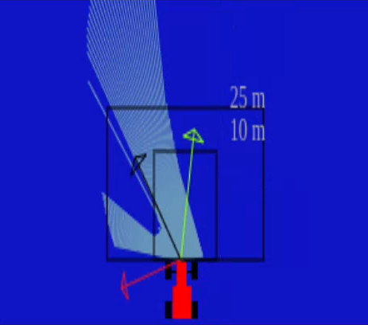
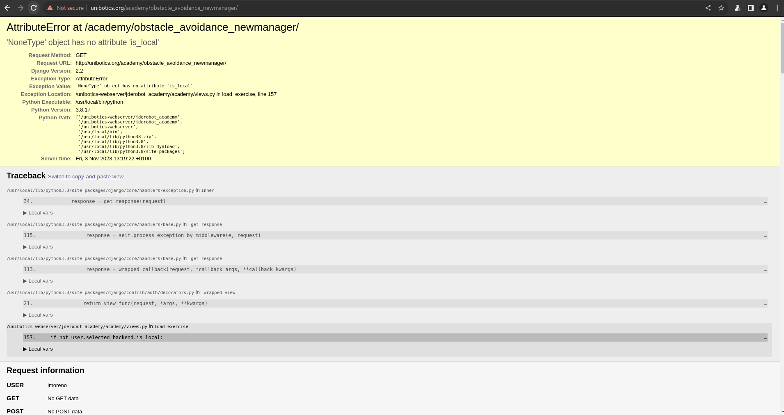

## Objective of this task
For this task we are going to take the car we've been working on previously, and make it run laps around our digital track; with the added complexity of other cars that he must avoid.

To do this we have discarded the camera, and instead we added a lidar to the front of the vehicle. Using this LIDAR and pre mapped points around the circuit, we will calculate the Virtual Force Field (VFF) of our car.

## What is VFF
VFF is an algorithm very popular in the world of mobile robotics, as it allows for autonomous movement of a robot as long as we have a map where the robot can know its absolute position, a sensor to analyze its environments, and the ability to react to changes in its surroundings.



We are going to implement it by calculating two vectors, one that points to our destination, and another one that points away from any obstacles. The sum of those two vectors will be our direction vector.

## Calculating the opposing force vector
For the opposing direction vector we are going to use the data given to us from the LIDAR, though this is not a simple plug and play operation.
1. First we are going to use the code provided by our teachers to parse the laser data, and store them in a list that holds the angle of the laser measured, and the distance measured by that laser.
   ```python
   def parse_laser_data (laser_data):
       laser = []
       i = 0
       while (i < 180):
           dist = laser_data.values[i]
           if dist > 10:
               dist = 10
           angle = math.radians(i-90) # because the front of the robot is -90 degrees
           laser += [(dist, angle)]
           i+=1
       return laser
   ```
2. Secondly we are going to take that list, and transform each angle-distance pair to (x,y) coordinates relative to the car.
   ```python
   def getOppForce():
       laser = parse_laser_data(HAL.getLaserData())
       cartesian_laser = []
       for dist, angle in laser:
           x = (1/dist) * math.cos(angle) * -1
           y = (1/dist) * math.sin(angle) * -1
           v = (x,y)
           cartesian_laser +=  [v]
   ```
3. Lastly, we are going to take the mean of all the cartesian values, and clamp it around (-3, 3) so it shows better in our graphical interface and limits erroneous values that can sometimes come up.
   ```python
   def getOppForce():
       laser = parse_laser_data(HAL.getLaserData())
       cartesian_laser = []
       for dist, angle in laser:
           x = (1/dist) * math.cos(angle) * -1
           y = (1/dist) * math.sin(angle) * -1
           v = (x,y)
           cartesian_laser +=  [v]
       laser_mean = np.mean(cartesian_laser, axis=0)
       laser_mean[0] = max(min(laser_mean[0], 3), -3)
       laser_mean[1] = max(min(laser_mean[1], 3), -3)
       return laser_mean
   ```

## Calculating the direction vector
To calculate the direction vector we need to create a vector that points to the next target in the map. For this we will follow these steps:
1. First we get the absolute coordinate values of the next target by making a call to the API, and we parse it through this function to transform the absolute cartesian coordinates to coordinates relative to our vehicle.
   ```python
   currentTarget = GUI.map.getNextTarget()
   absTarget = [currentTarget.getPose().x, currentTarget.getPose().y]
   relTarget = absolute2relative(absTarget[0], absTarget[1], carX, carY, yaw)
    
   def absolute2relative (x_abs, y_abs, robotx, roboty, robott):
       # robotx, roboty are the absolute coordinates of the robot
       # robott is its absolute orientation
       # Convert to relatives
       dx = x_abs - robotx
       dy = y_abs - roboty
    
       # Rotate with current angle
       x_rel = dx * math.cos (-robott) - dy * math.sin (-robott)
       y_rel = dx * math.sin (-robott) + dy * math.cos (-robott)
    
       return x_rel, y_rel
   ``` 
2. Secondly we clamp the function around (-3,3) for the same reasons as before, and because if we had taken the original values, the vector would have been too large to process confidently when the car is far away from the target.
   ```python
   def getAttForce(target_rel):
       targetX = max(min(target_rel[0], 3), -3)
       targetY = max(min(target_rel[1], 3), -3)
       return (targetX,targetY)
   ```
3. Lastly, we run this loop that constantly checks if we got close to our target, and if we did, it changes to the next intended target. 
   ```python
   if (((absTarget[0]-1.3) < carX < (absTarget[0]+1.3)) and
       ((absTarget[1]-1.3) < carY < (absTarget[1]+1.3))):
        currentTarget.setReached(True)
   ```
## Translating vector values to the car
Now we have a VFF implemented, but we still need to translate vector values to movement. This is the hardest part of the whole exercise, as the best method we have now is trial and error.

Our first attempts were to use the Y axis of the DirectionVector as angular velocity, while keeping linear velocity constant. But this proved to be too slow for straights, and too fast when dealing with turns.

Our next attempt was to add X values as linear speed and Y values as angular. Predictably, this meant that as the car neared his next target it would slow down almost to a stop, and when it reached it, it would very quickly accelerate due to the pull of the new far away target.

To solve this we tried adding a constant number to the linear velocity, this solved the starting and stopping problem, but it created a new one; the car just wouldn't turn in time to avoid walls and other cars.

A solution we came up with is incrementing proportionally the X and Y values of the opposing force with two different constants. This seemed to work, but we recommend some testing, as your results may vary, due to the slightest changes in the iterative code, and the specs of your machine could warrant adjustments for these constants. But if you want a starting point, these are the ones we ended up on:

```python
x = (1/dist) * math.cos(angle) * -2
y = (1/dist) * math.sin(angle) * -10.5
#------------------------------------------
HAL.setV(avgForce[0]+5)
HAL.setW(avgForce[1])
```
## Problems faced
By far the most challenging aspect of this task was adjusting the values given to the car depending on the vectors received. This was also made harder because the walls had no collisions, so any small mistake meant restarting the entire simulation, and this process is not a quick one. Another aspect that proved challenging was the position of the targets, as they were few of them and very spaced out; clamping the target vector helped avoid  the car overspeeding and taking curves in a straight line.

One last problem was connectivity, as after an update, the website would randomly end connection, and when it worked, it became sluggish and slow.




You can see the same connectivity problems on the videos we made, as it randomly cuts off the simulation, and the limitations of our machine makes it impossible to run the program locally at the same time as the recording software. 

## Results
The first two videos showcase some errors we encountered while executing the code, the last two represent a full lap around the circuit (divided into two due to github limitations on file size).

[1-Smooth_Ride_But_Lag.webm](https://github.com/lmorenog2021/lmorenog2021.github.io/assets/92941117/a9637039-565f-4f97-b7c8-69a78ad83c89)

[2-Different_type_of_lag.webm](https://github.com/lmorenog2021/lmorenog2021.github.io/assets/92941117/9c22a4cf-cdd8-40c3-9c97-1460708484f5)

[Finished_Lap_Part1.webm](https://github.com/lmorenog2021/lmorenog2021.github.io/assets/92941117/1a2508cf-58a5-4c4b-8734-c4bda4f246b3)

[Finished_Lap_Part2.webm](https://github.com/lmorenog2021/lmorenog2021.github.io/assets/92941117/ceac61b0-9bb3-45b3-a2da-5c3c2bdf579d)
